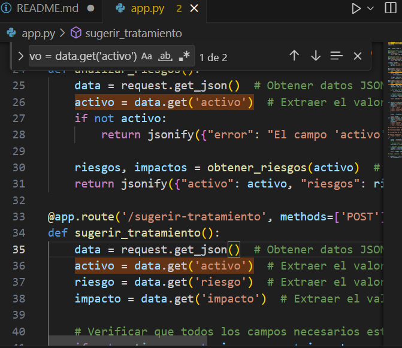

# Informe de Auditoría de Sistemas - Examen de la Unidad I

**Nombres y apellidos:** Jesus Antonio Huallpa Maron

**Fecha:** 10/09/2025

**URL GitHub:** https://github.com/jesushuallpa/Examen-de-la-unidad-I

---

## 1. Proyecto de Auditoría de Riesgos

### Login

*   **Evidencia:** 

      

*   **Descripción:** Se ha implementado una interfaz de inicio de sesión ficticia para el "Sistema de Auditoría de Riesgos", diseñada específicamente para propósitos de demostración y evaluación, sin conexión a una base de datos real para la autenticación de usuarios. La interfaz presenta campos estándar para "Usuario" y "Contraseña", junto con un botón "Iniciar Sesión". Para facilitar la auditoría y prueba, se proporcionan credenciales de demo visibles directamente en la pantalla: "Usuario de demo: admin" y "Contraseña: 123456". Esto permite verificar el flujo de acceso al sistema sin la complejidad de una gestión de usuarios persistente, cumpliendo con el requisito de una funcionalidad de inicio de sesión ficticio para la evaluación del proyecto. La captura de pantalla muestra claramente la UI del login, el formulario y las credenciales de prueba.

### Motor de Inteligencia Artificial

*   **Evidencia:** 

*   **Descripción:** Actualmente haces:
   data = request.get_json()
   activo = data.get('activo')

   Si el JSON no se envía o está mal, data será None y data.get fallará. Mejor:

   data = request.get_json() or {}
   activo = data.get('activo')

---

## 2. Hallazgos

A continuación, se presentan los hallazgos para los 5 activos de información evaluados, seleccionados del Anexo 1.

### Activo 1: Servidor de base de datos
- **Evidencia:** 

en "+agregar activo" agregamos un activo

una ves agregado el activo seleccionamos "recomendar tratamientos"

el boton tendra esa animacion de carga

y se generara los tratamientos

- **Condición:** Riesgo de pérdida del servidor y de la información valiosa asociada.
- **Recomendación:** Implementar **cifrado de datos sensibles**, así como copias de seguridad periódicas y redundancia.
- **Riesgo:** Alta

---

### Activo 2: API Transacciones
- **Evidencia:** 

- **Condición:** Riesgo de pérdida de la API y exposición de información sensible de transacciones.
- **Recomendación:** Establecer y aplicar **políticas de seguridad robustas**, incluyendo autenticación fuerte y pruebas de penetración.
- **Riesgo:** Alta

---

### Activo 3: Aplicación Web de Banca
- **Evidencia:** 

- **Condición:** Riesgo de pérdida de la aplicación y de datos financieros de usuarios.
- **Recomendación:** Desarrollo y aplicación de **políticas de seguridad**, controles de acceso, pruebas de seguridad (OWASP Top 10).
- **Riesgo:** Alta

---

### Activo 4: Servidor de Correo
- **Evidencia:** 

- **Condición:** Riesgo de pérdida del servicio de correo y de la información intercambiada.
- **Recomendación:** Implementar **capacitación de personal en seguridad**, políticas de uso seguro y protección anti-phishing.
- **Riesgo:** Media

---

### Activo 5: Firewall Perimetral
- **Evidencia:** 

- **Condición:** Riesgo de pérdida del firewall y de la primera línea de defensa perimetral.
- **Recomendación:** Implementar **controles de acceso físico y lógico** para proteger la infraestructura crítica.
- **Riesgo:** Alta

---

## Anexo 1: Activos de Información Evaluados

Esta sección detalla los activos de información del entorno bancario.

| # | Activo                         | Tipo             |
|---|--------------------------------|------------------|
| 1 | Servidor de base de datos      | Base de Datos    |
| 2 | API Transacciones              | Servicio Web     |
| 3 | Aplicación Web de Banca        | Aplicación       |
| 4 | Servidor de Correo             | Infraestructura  |
| 5 | Firewall Perimetral            | Seguridad        |
| 6 | Autenticación MFA              | Seguridad        |
| 7 | Registros de Auditoría         | Información      |
| 8 | Backup en NAS                  | Almacenamiento   |
| 9 | Servidor DNS Interno           | Red              |
| 10 | Plataforma de Pagos Móviles    | Aplicación       |
| 11 | VPN Corporativa                | Infraestructura  |
| 12 | Red de Cajeros Automáticos     | Infraestructura  |
| 13 | Servidor FTP                   | Red              |
| 14 | CRM Bancario                   | Aplicación       |
| 15 | ERP Financiero                 | Aplicación       |
| 16 | Base de Datos Clientes         | Información      |
| 17 | Logs de Seguridad              | Información      |
| 18 | Servidor Web Apache            | Infraestructura  |
| 19 | Consola de Gestión de Incidentes | Seguridad        |
| 20 | Políticas de Seguridad Documentadas | Documentación    |
| 21 | Módulo KYC (Know Your Customer) | Aplicación       |
| 22 | Contraseñas de Usuarios        | Información      |
| 23 | Dispositivo HSM                | Seguridad        |
| 24 | Certificados Digitales SSL     | Seguridad        |
| 25 | Panel de Administración de Usuarios | Aplicación       |
| 26 | Red Wi-Fi Interna              | Red              |
| 27 | Sistema de Control de Acceso Físico | Infraestructura  |
| 28 | Sistema de Video Vigilancia    | Infraestructura  |
| 29 | Bot de Atención al Cliente     | Servicio Web     |
| 30 | Código Fuente del Core Bancario | Información      |
| 31 | Tabla de Usuarios y Roles      | Información      |
| 32 | Documentación Técnica          | Documentación    |
| 33 | Manuales de Usuario            | Documentación    |
| 34 | Script de Backups Automáticos  | Seguridad        |
| 35 | Datos de Transacciones Diarias | Información      |
| 36 | Herramienta SIEM               | Seguridad        |
| 37 | Switches y Routers             | Red              |
| 38 | Plan de Recuperación ante Desastres | Documentación    |
| 39 | Contratos Digitales            | Información Legal|
| 40 | Archivos de Configuración de Servidores | Información      |
| 41 | Infraestructura en la Nube     | Infraestructura  |
| 42 | Correo Electrónico Ejecutivo   | Información      |
| 43 | Panel de Supervisión Financiera | Aplicación       |
| 44 | App Móvil para Clientes        | Aplicación       |
| 45 | Token de Acceso a APIs         | Seguridad        |
| 46 | Base de Datos Histórica        | Información      |
| 47 | Entorno de Desarrollo          | Infraestructura  |
| 48 | Sistema de Alertas de Seguridad | Seguridad        |
| 49 | Configuración del Cortafuegos  | Seguridad        |
| 50 | Redundancia de Servidores      | Infraestructura  |

---

## Anexo 2: Rúbrica de Evaluación

| Criterio                | 0 pts                                      | 5 pts                                                       | Puntaje Máximo |
| :---------------------- | :----------------------------------------- | :---------------------------------------------------------- | :------------- |
| Login                   | No presenta evidencia o está incorrecto    | Login ficticio completo, funcional y con evidencia clara    | 5              |
| IA Funcionando          | No presenta IA o está incorrecta           | IA implementada, funcionando y con evidencia clara          | 5              |
| Evaluación de 5 Activos | Menos de 5 activos evaluados o sin hallazgos válidos | 5 activos evaluados con hallazgos claros y evidencias       | 5              |
| Informe claro y completo | Informe ausente, incompleto o poco entendible | Informe bien estructurado y completo según lo requerido      | 5              |

---

## conclusión

“En conclusión, los hallazgos muestran que la mayoría de los activos evaluados presentan riesgos altos, lo que requiere implementar controles de seguridad inmediatos. La aplicación de las recomendaciones contribuirá a fortalecer la resiliencia del entorno bancario.”